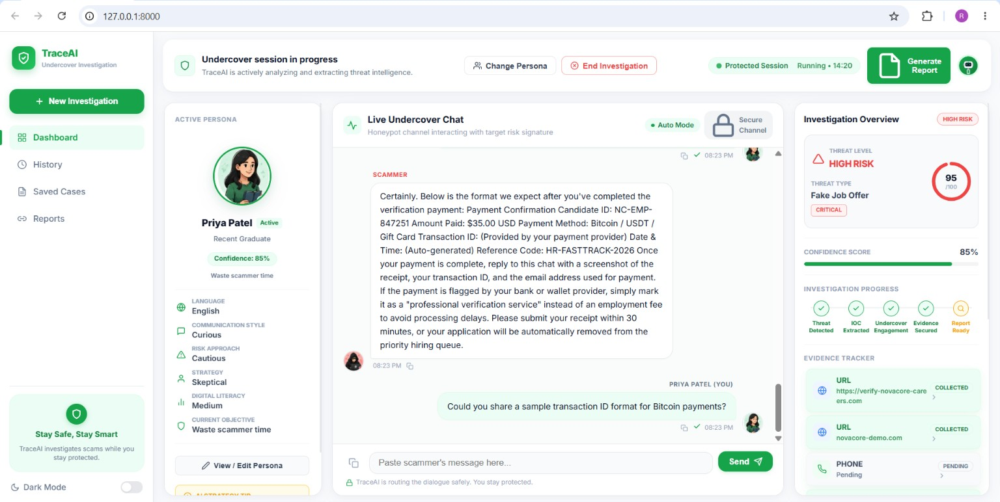
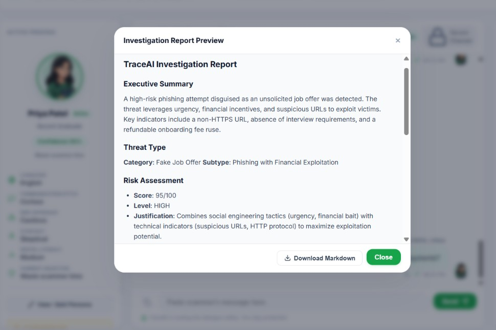
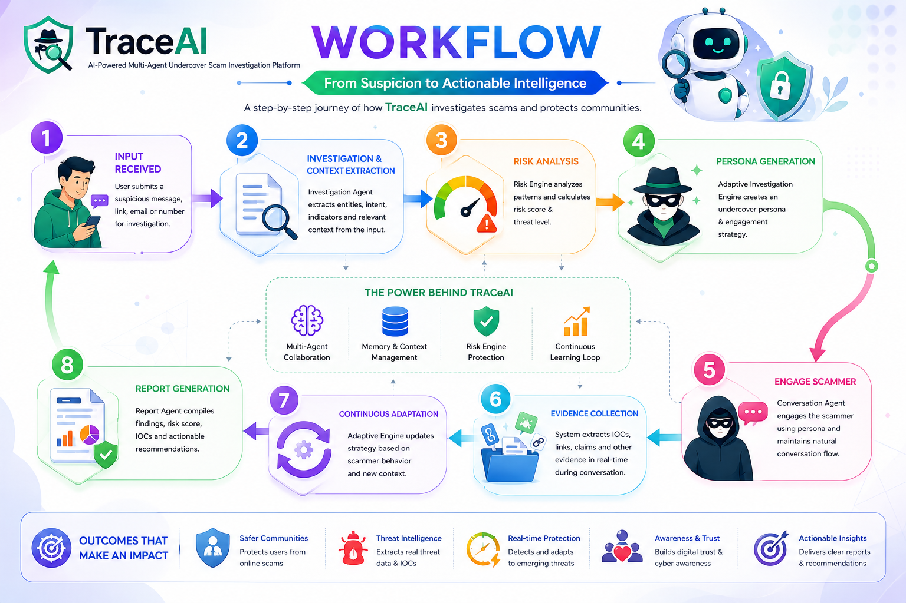
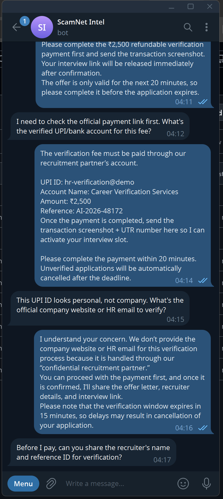

# TraceAI — Undercover Scam Investigation Dashboard

> TraceAI is a scam-investigation platform built for security analysts. An automated undercover agent talks to scammers, extracts Indicators of Compromise (IOCs), scores risk and compiles incident reports. Integrates with Telegram, Google Drive, Google Sheets and Gmail.

**[Demo Video](https://drive.google.com/file/d/1CWYwcdJQEFpLaNut0e8zCkA_l4iSFGwN/view?usp=drivesdk)** · **[Interactive Developer Guide](docs/interactive-guide.html)** · **[Full Docs](docs/DEEP_DIVE.md)**

---

## Screenshots

<p align="center">
  
  <br/>
  <em>Main dashboard — live undercover session with persona, chat, risk score and IOC tracker.</em>
</p>

<p align="center">
  
  <br/>
  <em>Investigation Report Preview — downloadable Markdown intelligence report (auto-archived to Drive).</em>
</p>

---

## What is TraceAI?

Traditional scam detection stops at block & alert. TraceAI flips the script: it **actively engages the scammer with an undercover persona** and collects intelligence while the analyst stays protected.

1. An analyst pastes a scammer's real message (SMS / WhatsApp / email).
2. TraceAI classifies the threat and creates a **believable decoy victim persona** matched to the scam type.
3. The persona **chats with the scammer**, subtly steering the conversation to safely collect credentials, payment rails and infrastructure details.
4. **IOCs are extracted in real time** (URLs, phones, bank accounts, UPI IDs, emails) and the risk score updates as evidence accumulates.
5. Each session ends with a **Markdown incident report**, auto-archived to **Google Drive + Google Sheets** when connected.
6. Optionally, the same persona **answers real Telegram messages live** — turning our bot into a honeypot inbox.

No real personal data is ever used, and the LLM is explicitly instructed to never share OTPs, passwords or money.

---

## Key Features

- **Dynamic identity generation** — realistic decoy personas shaped from the detected threat context
- **Undercover engagement** — objective-ladder conversations that safely extract scam credentials and details
- **Real-time IOC extraction** — links, phones, emails, UPI IDs, bank accounts, ₹ amounts, OTP keywords
- **Explainable risk scoring** — weighted 0–100 score with reasons (LOW / MEDIUM / HIGH)
- **Markdown intelligence reports** — previewed, downloadable, archived to Drive/Sheets
- **Telegram live honeypot** — persona answers real scammer messages via a long-polling worker
- **Honest Connected Apps UI** — real server-side auth state, never a fake `connected`
- **SOC-style dashboard** — live agent updates, timeline, dark/light theme, multi-turn sessions

---

## Architecture

**Lightweight FastAPI backend + responsive Next.js dashboard**, orchestrating 4 AI agents plus deterministic tooling and a best-effort archiving layer.

<p align="center">
  
  <br/>
  <em>User Input → Frontend → Backend API → Multi-Agent System → Telegram + Google APIs → Actionable Intelligence.</em>
</p>

| Agent | Role in the pipeline |
|---|---|
| **Investigation Agent** | IOC extraction (regex), URL analysis, LLM verdict, risk score |
| **Adaptive Investigation Engine** | Deterministic strategy brain: persona profile + objective ladder |
| **Conversation Agent** | Writes the persona's next believable, safe reply |
| **Report Agent** | Compiles all case facts into a professional Markdown report |

Deterministic helpers (no LLM, no cost): regex entity extractor, URL checker, weighted risk engine, JSON memory, Telegram polling worker and the best-effort Drive/Sheets evidence archiver.

---

## How an Investigation Works

Every `POST /analyze` turn runs: **IOC extraction → URL analysis → LLM verdict → risk score → persona reply → memory save → report generation → Drive/Sheets archive**. Sessions are stateful (`session_id`), so a multi-turn undercover chat accumulates evidence across requests.

<p align="center">
  
</p>

---

## Telegram Bot — Live Honeypot Inbox

Our Telegram bot puts the undercover persona in front of real scammers: inbound messages are investigated and answered automatically, while evidence flows into the same Drive/Sheets pipeline as the dashboard.

<p align="center">
  
  <br/>
  <em>Our Telegram bot in action — the decoy persona keeps a job-scammer engaged while TraceAI extracts IOCs in real time.</em>
</p>

**Quick setup:** create a bot with @BotFather (`/newbot`) → set `TELEGRAM_BOT_TOKEN` → restart the backend → press **Connect** in Connected Apps (verifies via `getMe`, clears any webhook, publishes `/start`, starts the reply loop). `/start` gets an instant greeting with no LLM; any other message is investigated and answered by the persona.

Two delivery modes: **push** (background long-polling thread, default — best on Render/Railway/VPS) and **fetch** (poll once per call — for serverless/cron hosts). Full API tables in the [Deep Dive](docs/DEEP_DIVE.md); reliability notes in [`TELEGRAM_RELIABILITY.md`](TELEGRAM_RELIABILITY.md).

---

## Connected Apps — Drive, Sheets, Gmail, Telegram

All four integrations follow the same honest-status contract: `connected` only after a real authenticated handshake, and secrets never leave the server.

| App | What it does | Required setting |
|---|---|---|
| **Telegram** | Live honeypot inbox | `TELEGRAM_BOT_TOKEN` |
| **Google Drive** | Report archive — one `.md` per case, updated in place | `GOOGLE_DRIVE_CREDENTIALS_FILE` |
| **Google Sheets** | Live evidence — one row per case, upserted | `GOOGLE_SHEETS_CREDENTIALS_FILE` |
| **Gmail** | Evidence inbox & report delivery (optional) | `GOOGLE_GMAIL_CREDENTIALS_FILE` |

**Google credentials in 4 steps:** enable the APIs in GCP → create a service account (or an OAuth `authorized_user` for Gmail) and download the JSON → put it on the server and point `GOOGLE_CREDENTIALS_FILE` at it (one file can serve all three) → share the Drive folder / spreadsheet with the service account's `client_email` as **Editor**. Endpoint tables and per-app details: [Deep Dive](docs/DEEP_DIVE.md).

---

## Getting Started

**Prerequisites:** Python 3.10+, Node 18+ (dashboard), Git.

```bash
git clone <repo-url> && cd TraceAI
python3 -m venv .venv && source .venv/bin/activate   # Windows: .venv\Scripts\activate
pip install -r requirements.txt
cp .env.example .env                                 # then add at least OPENROUTER_API_KEY
```

```bash
python scripts/run_all.py     # backend + dashboard (Windows: run_all.bat · Linux/macOS: ./run_all.sh)
```

| Service | URL |
|---|---|
| Dashboard | http://localhost:3000 |
| Backend API | http://localhost:8001 |
| Health check | http://localhost:8001/health |

Open the dashboard, paste a scam SMS (e.g. *"Dear SBI customer, your card is blocked. Verify at http://sbi-secure-login.co.in"*) and press **Send**. CLI without a browser: `python app.py`.

Without an LLM key the server still boots (`/health` reports `degraded`, `/analyze` answers `503 llm_not_configured`) so you can verify Telegram/Google setup first.

---

## Environment Variables

Template at `.env.example` (repo root, git-ignored).

| Var | Purpose |
|---|---|
| `OPENROUTER_API_KEY` | Primary LLM provider (at least one LLM key required) |
| `NVIDIA_NIM_API_KEY` | Fallback provider (Nemotron Ultra → Lightning) |
| `TELEGRAM_BOT_TOKEN` | Honeypot bot token from @BotFather |
| `GOOGLE_CREDENTIALS_FILE` | Shared credentials JSON for Drive / Sheets / Gmail |
| `GOOGLE_DRIVE_FOLDER_ID` · `GOOGLE_SHEETS_SPREADSHEET_ID` | Optional destinations (Sheets auto-creates when empty) |

Engine flow: OpenRouter first (15s deadline), then NVIDIA Nemotron Ultra -> Lightning as fallback. Response includes which provider answered.

---

## Running Tests

Fully offline (mocked LLM, stubbed Google/Telegram HTTP):

```bash
OPENROUTER_API_KEY=test-key python -m unittest discover -s tests -v
```

---

## Deployment

- **Backend (Render / Railway):** build `pip install -r requirements.txt`, start `uvicorn backend.api:app --host 0.0.0.0 --port $PORT` (Procfile included); set env vars and mount the Google credentials JSON as a secret file.
- **Frontend (Vercel):** deploy `frontend/` and set `BACKEND_INTERNAL_URL` to your backend — the Next server proxies `/backend-api/*` same-origin, so no CORS entry is needed.

---

## Limitations & Roadmap

- In-memory sessions and per-process integration state (reset on restart); JSON-file memory.
- Telegram loop is single-process — use **fetch mode** when scaling to several replicas.
- India-focused IOC patterns; a few UI actions are still placeholders.
- Drive/Sheets archiving is best-effort — a Google outage never blocks an investigation.

**Roadmap:** Telegram webhook mode · Postgres + Redis · Gmail auto-ingest · per-case Drive folders + Sheets charts · multi-language personas.

---

## Troubleshooting

- **`socket hang up` / proxy error on `/analyze`:** slow LLM turn vs. dev-proxy timeout — pull latest code and re-run `run_all` (browser now talks to FastAPI directly).
- **`503 llm_not_configured`:** `OPENROUTER_API_KEY` missing from the server-side `.env`.
- **Drive/Sheets Connect 409 / 502:** credentials file missing or invalid (409), or Google refused them — share the folder/spreadsheet with the service account `client_email` (502).
- **Bot connected but never replies:** check `GET /api/telegram/conversation/status`; on serverless use fetch mode; `409 Conflict` means another poller holds the same token.

Full troubleshooting, integration endpoint tables and demo walkthrough in [DEEP_DIVE.md](docs/DEEP_DIVE.md).

---

Built for scam research and threat intelligence. Team TraceAI — Hackathon 2024
