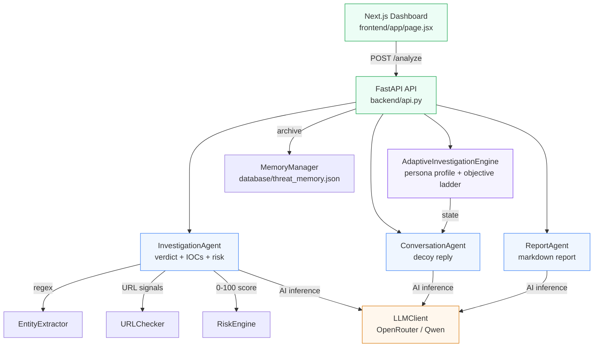
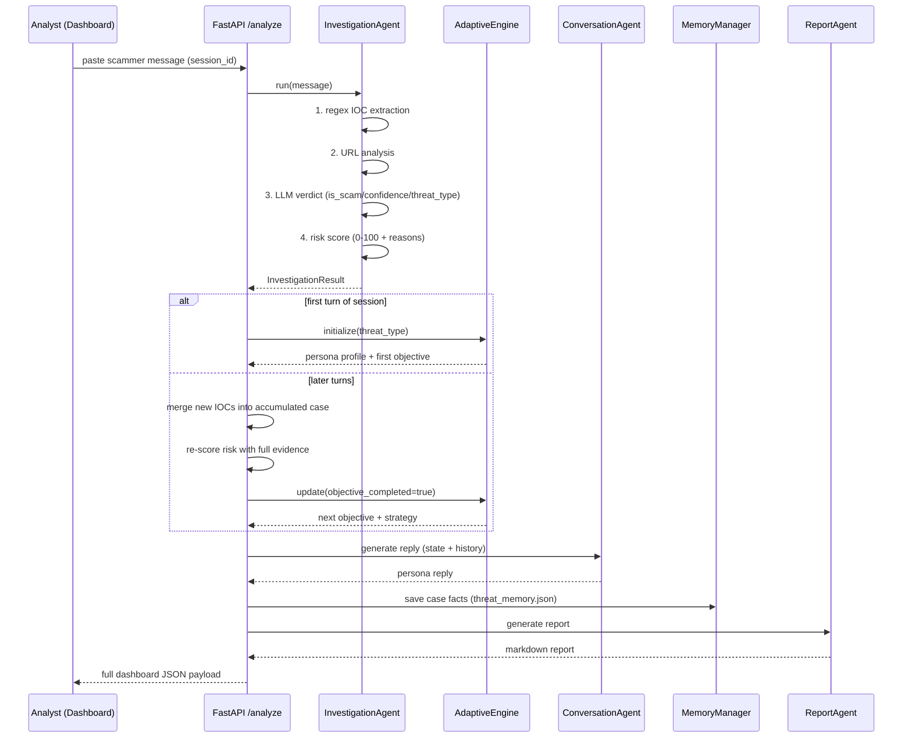

# 🛡️ TraceAI — Undercover Scam Investigation Dashboard

> **TraceAI** is an AI-driven scam-investigation platform: an **automated undercover agent** talks to online scammers, extracts **Indicators of Compromise (IOCs)**, scores risk and compiles detailed incident reports for security analysts. It also integrates with the analyst's real tooling over **Telegram, Google Sheets, Google Drive and Gmail**.

---

## 📖 Table of Contents
- [What is TraceAI?](#-what-is-traceai)
- [Key Features](#-key-features)
- [Architecture](#-architecture)
- [How an Investigation Works (request flow)](#-how-an-investigation-works)
- [Repository Layout](#-repository-layout)
- [Technology Stack](#-technology-stack)
- [Environment Variables](#-environment-variables)
- [Getting Started](#-getting-started)
- [Running Unit Tests](#-running-unit-tests)
- [Production Deployment](#-production-deployment)
- [Limitations & Roadmap](#-limitations--roadmap)
- [Interactive Developer Guide](#-interactive-developer-guide)

---

## 🔍 What is TraceAI?

Investigating scams is hard because scammers vanish the moment they smell a trap. TraceAI puts an **AI-driven proxy in the communication path**:

1. An analyst pastes a scammer's real message (SMS / WhatsApp / email).
2. TraceAI classifies the threat and creates a **believable decoy victim persona** matched to the scam type (a worried SBI customer, a job-hunting graduate, a wealthy retiree…).
3. The persona then **chats with the scammer**, subtly steering the conversation to safely collect credentials, payment rails, and infrastructure details.
4. During the chat TraceAI **extracts IOCs in real time** (URLs, phone numbers, bank accounts, UPI IDs, emails) and re-scores the risk as evidence accumulates.
5. Each session ends with a **markdown incident report** that analysts can download.

The analyst stays completely safe: no real personal data is ever used, and the LLM is explicitly instructed to never share OTPs, passwords, or money.

---

## ✨ Key Features

| Feature | What it does |
|---|---|
| **Dynamic Identity Generation** | The Adaptive Investigation Engine shapes a realistic victim persona from the detected threat context |
| **Undercover Engagement** | Auto-routes the conversation to safely extract scam credentials and details |
| **IOC Extraction** | Real-time detection of scam links, bank accounts, emails, phone numbers, UPI IDs, amounts and OTP keywords |
| **Risk Score & Grading** | Explainable 0–100 risk scoring with reasons (LOW / MEDIUM / HIGH) |
| **Interactive Console & Timeline** | Live agent updates and trace logs in a SOC-style dashboard |
| **Markdown Report Generation** | Structured security-intelligence reports, previewed & downloadable |
| **Dark / Light Theme** | Full UI theming via CSS variables |
| **Session Continuity** | Multi-turn conversation state keyed by `session_id` |
| **Live Telegram Engagement** | The undercover persona answers real Telegram messages (long-polling worker) |
| **Evidence Archive** | Finished reports are pushed to Google Drive and case rows upserted into Google Sheets |

---

## 🏗️ Architecture

TraceAI is a **lightweight FastAPI backend + responsive Next.js dashboard**. The backend orchestrates **4 AI agents** plus deterministic tooling:



### The agents

| Agent | Module | Role in the pipeline |
|---|---|---|
| **Investigation Agent** | `agents/investigation_agent.py` | Extracts IOCs (regex), analyses URLs, asks the LLM for a verdict, validates output, computes risk |
| **Adaptive Investigation Engine** | `tools/adaptive_investigation_engine.py` | Deterministic "strategy brain": selects the victim profile & objective ladder per threat |
| **Conversation Agent** | `agents/conversation_agent.py` | Writes the persona's next believable reply (< 35 words, safe by prompt rules) |
| **Report Agent** | `agents/report_agent.py` | Compiles all case facts into a professional markdown report |

### Deterministic support tools (no LLM, no cost)

| Tool | Purpose |
|---|---|
| `tools/entity_extractor.py` | Regex IOC extraction (phones, emails, URLs, UPI, ₹ amounts, banks, OTP) |
| `tools/url_checker.py` | Structural URL signals: HTTPS, shortener domains, subdomain depth |
| `tools/risk_engine.py` | Weighted, explainable 0–100 risk scoring |
| `tools/memory_manager.py` | JSON-file archive of every investigation |
| `tools/conversation_session.py` | Per-session chat transcript |
| `tools/prompt_loader.py` | Loads prompt templates from `prompts/` |

---

## 🔄 How an Investigation Works

Every `POST /analyze` call runs this pipeline:



> ⚙️ Session = stateful conversation. The API keeps `ConversationSession`, `AdaptiveInvestigationEngine` state, accumulated IOCs and the latest report in an **in-memory dict keyed by `session_id`**, so a multi-turn undercover chat works across requests. State resets when the process restarts.

---

## 📁 Repository Layout

```
TraceAI/
├── agents/                  # AI agents (LLM consumers)
│   ├── investigation_agent.py   # step 1: verdict + IOCs + risk
│   ├── conversation_agent.py    # step 2: decoy reply
│   └── report_agent.py          # step 3: markdown report
├── backend/
│   ├── api.py               # FastAPI app (POST /analyze, /new, /health, /api/integrations)
│   └── telegram_routes.py   # Telegram test + conversation endpoints
├── integrations/            # external apps (honest connect/status layer)
│   ├── base.py              # BaseIntegration contract + honest status payloads
│   ├── google_api.py        # shared Google OAuth + REST plumbing
│   ├── telegram/            # Telegram Bot API (getMe / getUpdates / sendMessage)
│   ├── google_sheets/       # live investigation evidence (values.append / upsert)
│   ├── google_drive/        # investigation reports (markdown upload/update)
│   └── gmail/               # evidence inbox + report delivery
├── tools/                   # deterministic engines (no LLM)
│   ├── adaptive_investigation_engine.py  # persona + objective brain
│   ├── entity_extractor.py  # regex IOC extraction
│   ├── risk_engine.py       # 0-100 scoring rubric
│   ├── url_checker.py       # URL structural signals
│   ├── memory_manager.py    # JSON archive (database/threat_memory.json)
│   ├── conversation_session.py   # chat transcript per session
│   ├── conversation_service.py   # Telegram <-> agent loop (per chat)
│   ├── telegram_conversation_worker.py  # background polling worker
│   ├── evidence_archive.py  # best-effort Drive/Sheets export
│   └── prompt_loader.py     # loads prompts/*.txt
├── llm/
│   └── llm_client.py        # single OpenRouter/OpenAI wrapper
├── prompts/                 # editable agent system prompts (txt)
├── utils/
│   └── schemas.py           # Pydantic contracts (Investigation/Conversation/Report)
├── frontend/                # Next.js 14 dashboard
│   ├── app/page.jsx         # root dashboard + API client
│   ├── app/globals.css      # design system (light/dark)
│   ├── components/          # Sidebar/Topbar/Persona/Chat/Overview/...
│   ├── lib/constants.js     # UI contract + IOC highlighter
│   └── public/assets/       # persona avatar PNGs
├── tests/                   # offline mock-based unit tests
├── app.py                   # CLI single-shot investigation
├── streamlit_app.py         # static UI prototype (not wired to agents)
├── config.py                # env-based settings (OPENROUTER_API_KEY...)
├── requirements.txt         # slim backend requirements
├── Procfile                 # Render start command
└── database/                # (git-ignored) threat_memory.json archive
```

---

## 💻 Technology Stack

| Layer | Tech |
|---|---|
| **Backend** | Python 3.10+, FastAPI, Uvicorn |
| **Frontend** | Next.js 14 (React 18), vanilla CSS with CSS variables, `marked` |
| **AI / LLM** | OpenAI SDK → **OpenRouter** gateway (`qwen/qwen3-32b` default) |
| **Data / Persistence** | Pydantic v2 models; JSON-file memory (`database/threat_memory.json`); Google Sheets/Drive via REST |
| **Integrations** | Telegram Bot API, Google OAuth 2.0 (`google-auth`) + REST (Drive / Sheets / Gmail) |
| **Testing** | Python `unittest` with mocked LLM (offline) |

---

## 🔑 Environment Variables

Create a `.env` at the repository root. A template lives at `.env.example`:

```bash
cp .env.example .env
```

```env
# LLM — set AT LEAST ONE provider key:
OPENROUTER_API_KEY=your-openrouter-api-key   # https://openrouter.ai/keys
NVIDIA_NIM_API_KEY=your-nvidia-nim-api-key   # https://build.nvidia.com (fastest)

# Optional — OpenRouter answers first; NVIDIA is the fallback stage
LLM_MODEL=qwen/qwen3-32b
NVIDIA_NIM_MODEL=nvidia/nemotron-3-ultra-550b-a55b

# Optional — how long OpenRouter may take before NVIDIA takes over
OPENROUTER_DEADLINE=15

# Optional — extra browser origins allowed to call the API cross-origin
CORS_ALLOW_ORIGINS=https://my-dashboard.example

# Optional — external apps (see .env.example for the full reference)
TELEGRAM_BOT_TOKEN=123456:ABC...
GOOGLE_CREDENTIALS_FILE=/etc/scamnet/google-credentials.json
GOOGLE_SHEETS_SPREADSHEET_ID=1AbC...
GOOGLE_DRIVE_FOLDER_ID=1XyZ...
```

> ℹ️ **Missing LLM keys no longer stop the server.** The API boots,
> `GET /health` reports `{"status": "degraded", "llm_configured": false}` and
> `POST /analyze` answers HTTP **503 `llm_not_configured`** — so you can verify the
> Telegram/Google setup first. Set `TRACEAI_STRICT_CONFIG=1` to fail fast instead.

### ⚡ AI Engine: fixed flow — OpenRouter first, NVIDIA nemotron as fallback

The engine is **not** selectable in the dashboard any more: one pasted scammer
message always takes the same route, so results stay predictable (and the UI
stops hammering `/api/llm/*` on every render).

```
user pastes a message
        |
        v
1. OpenRouter  (LLM_MODEL, default qwen/qwen3-32b)
        |   no reply within OPENROUTER_DEADLINE = 15 s  ->  call abandoned
        v
2. NVIDIA NIM  nvidia/nemotron-3-ultra-550b-a55b        (priority)
        |   failed / too slow
        v
3. NVIDIA NIM  nvidia/nemotron-3.5-lightning-30b-a3b    (last resort)
```

- **OpenRouter first, always.** Add `OPENROUTER_API_KEY` to `.env`. If it
  answers inside 15 s the turn is done — NVIDIA is never touched.
- **15-second soft deadline.** `OPENROUTER_DEADLINE=15` (seconds; `0` disables
  it). The slow call is abandoned, **not retried**, so you never wait on a
  stalled gateway.
- **Exactly two NVIDIA models**, in this order: Nemotron 3 Ultra first,
  Nemotron 3.5 Lightning only when Ultra fails. Get the key at
  [build.nvidia.com](https://build.nvidia.com) and set `NVIDIA_NIM_API_KEY`.
- **Each `/analyze` response still reports the truth:** the `llm` block shows
  which provider/model answered each stage and how many fallbacks were used.
- **Escape hatches (ops only, not in the UI):** `POST /api/llm/select`,
  `GET /api/llm/status`, `GET /api/llm/models?provider=nvidia&refresh=true` —
  secret-free endpoints for debugging a deployment.

> ⚠️ **Tests:** the unit suite mocks the LLM. Run it with a dummy key:
> `OPENROUTER_API_KEY=test-key python -m unittest discover -s tests`.

---

## 🚀 Getting Started

> **TL;DR:** after the one-time setup below, run everything with
> **`python scripts/run_all.py`** (Windows: double-click `run_all.bat`).

### Prerequisites
- Python 3.10+
- Node 18+ (for the dashboard)
- Git

### 1. Clone & configure (once)

```bash
git clone <repo-url>
cd TraceAI

python3 -m venv .venv
source .venv/bin/activate         # Windows: .venv\Scripts\activate
pip install -r requirements.txt

cp .env.example .env              # Windows: copy .env.example .env
# then put your keys in .env (see below)
```

`.env` lives **at the repository root** (next to `config.py`) and is git-ignored.
The two keys that matter:

| Variable | What it enables | Where to get it |
|---|---|---|
| `OPENROUTER_API_KEY` | the AI agents (`/analyze`, Telegram replies, reports) | https://openrouter.ai/keys |
| `TELEGRAM_BOT_TOKEN` | the Telegram bot | Telegram → **@BotFather** → `/newbot` |

Without the LLM key the server still boots and serves the dashboard and the
integrations page (`/health` reports `degraded`, agent endpoints answer `503`).
`TELEGRAM_API_BASE` stays **empty** for real Telegram (it only exists to point at
`scripts/telegram_simulator.py`). The dashboard needs no keys - it talks to the
backend through the same-origin `/backend-api` proxy.

### 2. Run the whole project

```bash
python scripts/run_all.py          # backend + dashboard
```

Windows users can double-click **`run_all.bat`**; Linux/macOS: **`./run_all.sh`**.
Both accept the same flags:

| Flag | Effect |
|---|---|
| `--streamlit` | also start the Streamlit UI on `:8501` |
| `--no-frontend` | backend only (no Node needed) |
| `--reload` | restart the backend when Python files change |
| `--backend-port N` / `--frontend-port N` | use other ports (default `8001` / `3000`) |
| `--skip-install` | never run `npm install` |
| `--use-proxy` | route browser calls through `/backend-api` (reproduces hosted; slow turns may time out) |

The launcher prints a readiness report (missing keys, degraded mode), installs
dashboard dependencies the first time, waits until each service really answers,
prefixes every log line (`[api]`, `[ui]`, `[streamlit]`) and stops everything on
**Ctrl+C**.

```
  Dashboard      : http://localhost:3000
  Backend API    : http://localhost:8001
  Health check   : http://localhost:8001/health
  Telegram status: http://localhost:8001/api/telegram/conversation/status
```

### 3. Use it

Open the dashboard, click the **paste-template** icon (or type a scam SMS such as
*"Dear SBI customer, your card is blocked. Verify at http://sbi-secure-login.co.in"*)
and press **Send**.

With `TELEGRAM_BOT_TOKEN` set, the bot connects **and starts replying on boot** -
check **Connected Apps → Telegram** in the dashboard (the card shows the loop
running, with Start/Stop and a "send test hello" box), or message the bot from
Telegram: `/start` gets an instant greeting, any other message gets investigated
and answered by the persona.

Open the dashboard, click the **paste-template** icon (or type a scam SMS such as *"Dear SBI customer, your card is blocked. Verify at http://sbi-secure-login.co.in"*) and press **Send**.

> ℹ️ The dashboard talks to the backend **same-origin** through the Next.js
> `/backend-api` proxy, so it works on localhost, on Vercel and behind any reverse
> proxy. Local development defaults to `http://127.0.0.1:8001`; Vercel defaults to
> the existing hosted Railway backend. Point the proxy at another backend with
> `BACKEND_INTERNAL_URL` (`frontend/.env.local` for dev, project env for Vercel).
> `NEXT_PUBLIC_API_URL` remains available for direct browser→API calls (then the
> backend's `CORS_ALLOW_ORIGINS` must include the dashboard origin).

### CLI quick test (no browser)

```bash
export OPENROUTER_API_KEY=...
python app.py        # paste a suspicious message
```

---

## 🧪 Running Unit Tests

The suite is **offline** — the LLM is patched with mocks, so no API key or network is needed (a dummy key satisfies config import):

```bash
OPENROUTER_API_KEY=test-key python -m unittest discover -s tests -v
```

Covers: investigation/conversation/report agents (mocked LLM), the adaptive engine's profile & objective flow,
memory save/load/search/clear, the Telegram Bot API client + conversation worker (stub HTTP) and the Google
Drive/Sheets/Gmail clients (credentials → token refresh → authorized call → upload/upsert, all offline).

---

## 🔌 SCAMNET Integrations (Telegram / Sheets / Drive / Gmail)

The dashboard's **Connected Apps** modal (sidebar → *Connected Apps*) reports the
**real** server-side state of four external apps. Every app implements a genuine
authentication handshake — nothing is ever shown ased server-side settings |
|---|---|---|---|
| **Telegram** | Communication & intelligence gathering | `getMe` verifies the bot token and returns the bot identity | `TELEGRAM_BOT_TOKEN` |
| **Google Sheets** | Live investigation evidence | Reads the target spreadsheet, or **creates** `SCAMNET Investigation Evidence` when no id is set, then guarantees the `Evidence` tab | `GOOGLE_SHEETS_CREDENTIALS_FILE` *(or `GOOGLE_CREDENTIALS_FILE`)*, optional `GOOGLE_SHEETS_SPREADSHEET_ID`, `GOOGLE_SHEETS_WORKSHEET` |
| **Google Drive** | Investigation reports | `about.get` verifies the account and the destination folder | `GOOGLE_DRIVE_CREDENTIALS_FILE` *(or `GOOGLE_CREDENTIALS_FILE`)*, optional `GOOGLE_DRIVE_FOLDER_ID` |
| **Gmail** | Evidence inbox & report delivery | `users.getProfile` verifies the mailbox | `GOOGLE_GMAIL_CREDENTIALS_FILE` *(or `GOOGLE_CREDENTIALS_FILE`)* |

### Google credentials in 4 steps

1. Create a Google Cloud project and enable the **Drive API**, **Sheets API**
   and/or **Gmail API**.
2. Create a **service account** (Drive/Sheets) and download its JSON key, *or* run
   the OAuth consent flow for the mailbox and save the resulting
   `authorized_user` JSON (required for Gmail).
3. Put the file on the server (git-ignored) and set `GOOGLE_CREDENTIALS_FILE`
   — or the provider-specific variable — to its path in `.env`.
4. For a **service account**, share the Drive folder / spreadsheet with the
   account's `client_email` (**Editor**). Restart the backend, open *Connected
   Apps* and press **Connect**: the server tells you exactly what failed
   (`409` credentials missing/invalid, `502` Google refused the credentials).

> 🔐 Secrets never reach the browser: `GET /api/integrations` returns only
> *whether* settings exist, a human-readable state, and secret-free facts about a
> live session (bot username, Google account, spreadsheet id). Credentials-file
> paths and tokens are redacted from every log line, error message and response.

### Integration endpoints

| Endpoint | Purpose |
|---|---|
| `GET /api/integrations` | Honest status of all four apps (never a fake connection) |
| `POST /api/integrations/{id}/connect` | Real handshake: `200` connected · `409` not configured · `502` attempt failed |
| `POST /api/integrations/{id}/disconnect` | Drops the live session without touching credentials |
| `GET /health` | Liveness + `llm_configured` (reports `degraded` without an LLM key) |
| `GET /api/telegram/messages` · `POST /api/telegram/send-test` | Telegram communication test endpoints |
| `POST /api/telegram/conversation/start` · `/stop` | Start/stop the background reply loop (long-polling worker) |
| `POST /api/telegram/conversation/fetch` | Poll **once** and answer everything - the same loop for hosts that cannot keep a thread alive (cron / uptime pinger) |
| `POST /api/telegram/conversation/wake` | Send the liveness greeting to one chat - proves the outbound path with no LLM |
| `POST /api/telegram/conversation/message` · `GET /status` · `POST /reset` · `GET /commands` | Manual turn, honest loop+chat state, per-chat reset, bot commands |

When Drive/Sheets are connected, each `POST /analyze` turn also **archives the
case** (report uploaded/updated in Drive, case row upserted in Sheets). The
response carries an `archive` field with the per-app outcome; archiving is
best-effort and never breaks an investigation.

### Attaching the persona to a live scammer

1. Set `TELEGRAM_BOT_TOKEN` (from @BotFather) and restart the backend.
2. Connect Telegram in the dashboard, or `POST /api/integrations/telegram/connect`.
   The connect step **verifies the token with `getMe`, clears any webhook that
   would block `getUpdates`, publishes the `/start` command and starts the reply
   loop** - all in one call. (Set `TELEGRAM_AUTO_START_WORKER=0` to keep the loop
   manual.)
3. Every inbound message is investigated and answered by the undercover persona
   automatically; the reply is length-checked in Telegram's own unit (UTF-16 code
   units) and retried once if Telegram rate-limits it (HTTP 429).
4. Watch it with `GET /api/telegram/conversation/status` (polls, answered,
   greetings, last poll, last error), stop it with `/stop`, and reset one chat
   with `/reset`.

**How the bot behaves**

| Message | What happens |
|---|---|
| any text | investigation + persona reply (needs the LLM key) |
| `/start` · `/START` · `/start@your_bot` | fixed greeting, **no LLM needed**, never opens a case |
| photo / sticker / voice / edit / channel post | ignored safely (never crashes the loop) |

**Delivery models** - both use one shared worker and can never poll at the same
time, so a message is never answered twice:

* **push** - `/conversation/start` long-polls on a background thread (default,
  replies in seconds). Best on Render/Railway/a VPS.
* **fetch** - call `POST /api/telegram/conversation/fetch` from cron / an uptime
  pinger / a GitHub Action. Identical brain; works on hosts that suspend the
  process between requests, where a background thread would quietly stop.

**Testing the bot without a real bot token**

```bash
# terminal 1 - fake Telegram Bot API + fake LLM gateway
.venv/bin/python scripts/telegram_simulator.py

# terminal 2 - the REAL backend pointed at the fakes
TELEGRAM_BOT_TOKEN="99999:SIMULATOR-TOKEN" \
TELEGRAM_API_BASE="http://127.0.0.1:8099" \
OPENROUTER_API_KEY="simulator-key" \
OPENROUTER_BASE_URL="http://127.0.0.1:8098/v1" \
.venv/bin/uvicorn backend.api:app --port 8001

# terminal 3 - the "scammer" writes to the bot, then read what it answered
curl -X POST http://127.0.0.1:8099/_push -H 'Content-Type: application/json' \
     -d '{"chat_id": 424242, "text": "Your card is blocked, verify now"}'
curl http://127.0.0.1:8099/_state
```

`scripts/e2e_telegram_check.py` automates exactly that against the real HTTP
API (connect -> auto-start -> message in -> persona reply out -> second turn ->
`/start` -> stop -> fetch mode -> disconnect) and exits non-zero on any failure:

```bash
.venv/bin/python scripts/e2e_telegram_check.py
```

---

## ☁️ Production Deployment

### Backend (Render / Railway)
1. Create a Web Service and link this repo.
2. Build: `pip install -r requirements.txt`
3. Start: `uvicorn backend.api:app --host 0.0.0.0 --port $PORT` (or keep the `Procfile`)
4. Env vars: `OPENROUTER_API_KEY` and optionally `LLM_MODEL`.

### Frontend (Vercel)
1. Deploy the `frontend/` directory as a Next.js app.
2. Set `BACKEND_INTERNAL_URL` to your deployed backend URL (e.g.
   `https://traceai-backend-rg.up.railway.app`). This is optional for the current
   Vercel deployment because that URL is already the hosted fallback, but it must
   be set for any new/different backend. The Next server proxies
   `/backend-api/*` to it, so the browser stays same-origin and no CORS entry is
   needed.
3. Only if you call the API **directly** from the browser (rather than through the
   proxy): set `NEXT_PUBLIC_API_URL` on the frontend and add that origin to
   `CORS_ALLOW_ORIGINS` on the backend (no code edit required).

---

## ⚠️ Limitations & Roadmap

- **In-memory sessions** — state resets on restart; swap in Redis for horizontal scale.
- **Telegram loop is single-process** — one bot token polls one process. Run the
  fetch endpoint (not `/conversation/start`) when you scale to several replicas,
  or Telegram will answer `409` to the overlapping `getUpdates` calls.
- **JSON-file memory** — per-run archive on ephemeral hosts; a real DB is needed for durable history.
- **Static personas** — backend returns no avatar; the frontend maps occupations to avatar PNGs.
- **Stub UI actions** — History / Saved Cases / Edit Persona are placeholders.
- **India-focused extraction** — phone/UPI/bank patterns target the Indian threat landscape.
- **CORS allow-list** — configure with `CORS_ALLOW_ORIGINS`; the bundled dashboard
  needs no entry because it proxies same-origin.
- **Google credentials must be shared** — a service account only sees Drive files
  and spreadsheets explicitly shared with its `client_email`; Gmail additionally
  requires an OAuth user token (or Workspace domain-wide delegation).
- **Integration sessions are per-process** — a restart means pressing Connect
  again (the credentials stay configured).

---

## 🩺 Troubleshooting

### "Lost contact with the backend during analysis" / `Failed to proxy ... socket hang up`

**Cause:** `POST /analyze` runs three sequential OpenRouter calls (investigation →
conversation → report). On a slow model each call takes 10-15 s, so a turn lasts
35-50 s — but the Next.js **dev** rewrite proxy (`/backend-api` → FastAPI) drops
the connection after ~30 s with `ECONNRESET`. The backend keeps working (watch
the `[api]` lines: `stage 'investigation' took ...`), while the dashboard reports
a 500. Fast endpoints (`/health`, `/new`, integrations) are unaffected, which is
why only scam-message analysis fails.

**Fix:** pull the latest code and re-run `run_all` — the launcher now points the
browser directly at FastAPI (`NEXT_PUBLIC_API_URL`, CORS pre-filled), and browser
`fetch` has no 30 s ceiling. If you still see it, check the `[api]` stage timings:
every stage taking 15 s+ means the model itself is slow — try a faster
`LLM_MODEL` or check https://openrouter.ai status.

### "Cannot reach the backend" in the browser, but `curl` works

You are calling the API cross-origin (direct mode) from an origin the backend does
not allow. Either open the dashboard via `http://localhost:3000` /
`http://127.0.0.1:3000`, or add your origin to `CORS_ALLOW_ORIGINS` in `.env`
(`run_all` pre-fills localhost + LAN IP automatically).

### `/analyze` answers 503 `llm_not_configured`

`OPENROUTER_API_KEY` is missing from the server-side `.env`. The server boots
anyway (health + integrations keep working) — add the key and restart. Same fix
when the Telegram loop answers `/start` but fails every other message.

---

## 🧭 Interactive Developer Guide

**Want to really understand the codebase?** Open the **interactive HTML architecture guide** — a single self-contained file with clickable flowcharts, hoverable agent cards, expandable data contracts, an objective-ladder walkthrough and a live risk-score simulator:

👉 [`docs/interactive-guide.html`](docs/interactive-guide.html)

*(Open it directly in any browser — no build step, no internet required.)*

---

Made with 🛡️ for scam research and threat intelligence.
in any browser — no build step, no internet required.)*

---

Made with 🛡️ for scam research and threat intelligence.
