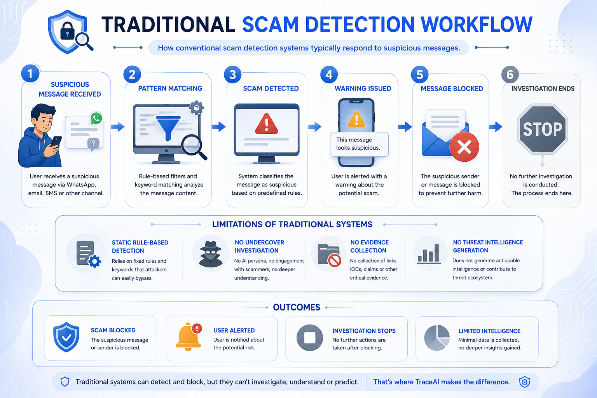
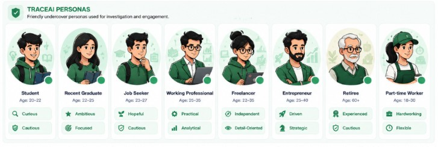
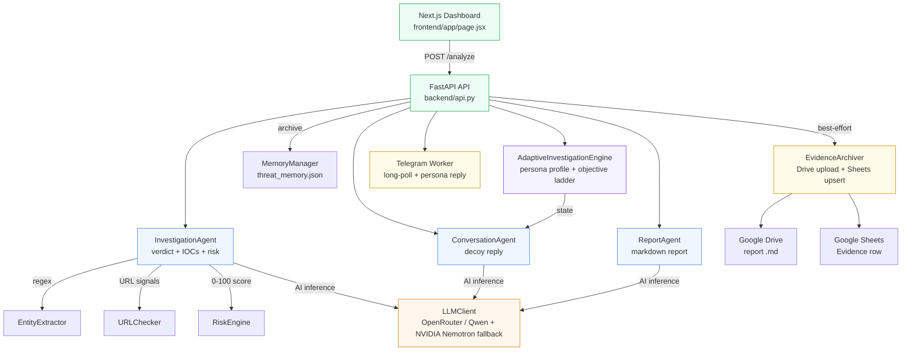
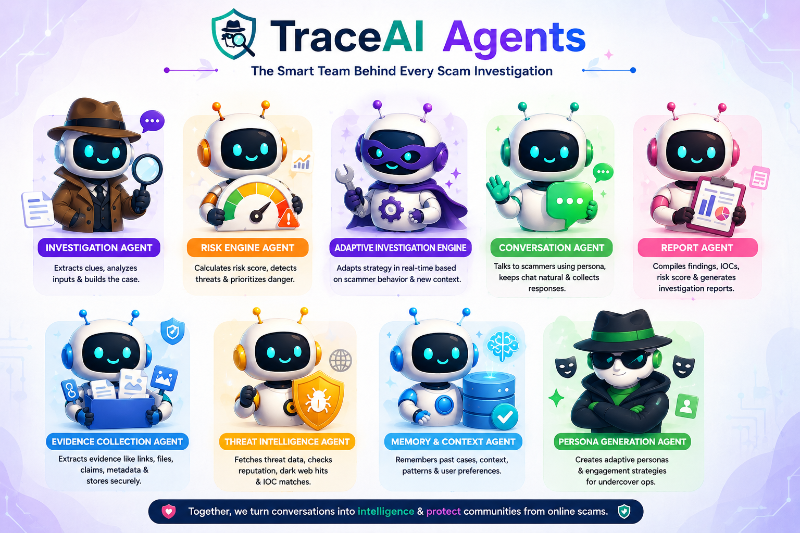
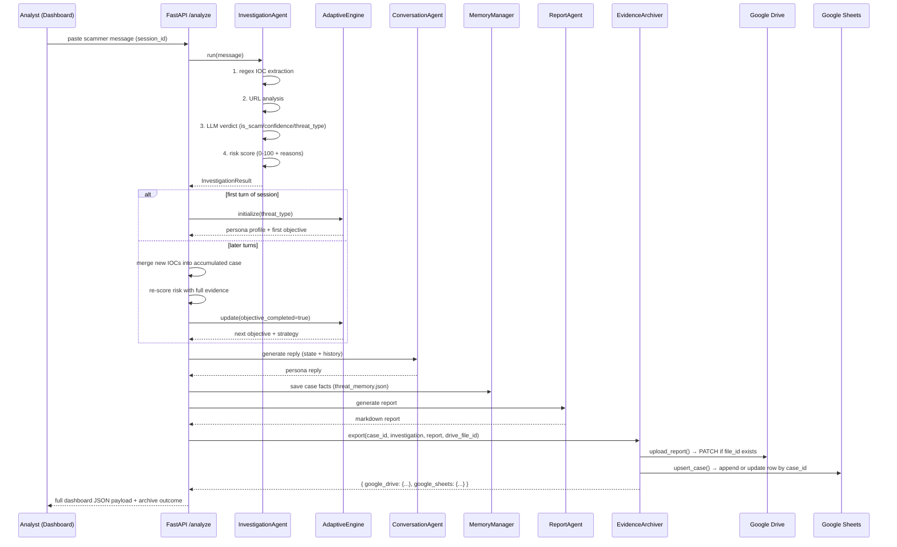

# 🛡️ TraceAI — Full Documentation & Deep Dive

> 📄 **Looking for the quick version?** See the [README](../README.md) at the repository root.
> This document keeps the complete deep-dive: connected-apps API tables, repository layout,
> integration endpoints, full troubleshooting and the demo walkthrough.

> **TraceAI** is an AI-driven scam-investigation platform: an **automated undercover agent** talks to online scammers, extracts **Indicators of Compromise (IOCs)**, scores risk and compiles detailed incident reports for security analysts. It also integrates with the analyst's real tooling over **Telegram, Google Sheets, Google Drive and Gmail**.

---

## 🎬 Demo Video

> 📹 **Live demo walkthrough** — see TraceAI catch a scammer in action, from paste → persona → live chat → Drive/Sheets archive.
>
> [▶️ Watch the Demo Video — Google Drive](https://drive.google.com/file/d/1CWYwcdJQEFpLaNut0e8zCkA_l4iSFGwN/view?usp=drivesdk)

*If the link asks for access, make sure you are logged into a Google account that has been granted view permission.*

---

## 📸 Screenshots

<p align="center">
  
  <br/>
  <em>Main dashboard — live undercover session with persona, chat, risk score and IOC tracker.</em>
</p>

<p align="center">
  
  <br/>
  <em>Investigation Report Preview — downloadable Markdown intelligence report (also auto-archived to Drive).</em>
</p>

---

## 📖 Table of Contents
- [What is TraceAI?](#-what-is-traceai)
- [Key Features](#-key-features)
- [Architecture](#-architecture)
- [How an Investigation Works](#-how-an-investigation-works)
- [Deep Dive: Connected Apps — Drive, Sheets, Telegram, Gmail](#-deep-dive-connected-apps--drive-sheets-telegram-gmail)
- [Repository Layout](#-repository-layout)
- [Technology Stack](#-technology-stack)
- [Environment Variables](#-environment-variables)
- [Getting Started](#-getting-started)
- [Running Unit Tests](#-running-unit-tests)
- [SCAMNET Integrations API](#-scamnet-integrations-api)
- [Production Deployment](#-production-deployment)
- [Limitations & Roadmap](#-limitations--roadmap)
- [Troubleshooting](#-troubleshooting)
- [Interactive Developer Guide](#-interactive-developer-guide)

---

## 🔍 What is TraceAI?

Investigating scams is hard because scammers vanish the moment they smell a trap. TraceAI puts an **AI-driven proxy in the communication path**:

### Why TraceAI?

Traditional scam-detection systems stop at block & alert. They never engage, never investigate and never collect intelligence — so scammers simply move on to the next target.

<p align="center">
  
  <br/>
  <em>Traditional workflow: detect → warn → block → stop. No investigation, no evidence, no intelligence.</em>
</p>

TraceAI flips the script: instead of just blocking a suspicious message, it **actively engages the scammer with an undercover persona**, safely collecting IOCs and actionable intelligence while the analyst stays protected.

1. An analyst pastes a scammer's real message (SMS / WhatsApp / email).
2. TraceAI classifies the threat and creates a **believable decoy victim persona** matched to the scam type (a worried SBI customer, a job-hunting graduate, a wealthy retiree…).
3. The persona then **chats with the scammer**, subtly steering the conversation to safely collect credentials, payment rails, and infrastructure details.
4. During the chat TraceAI **extracts IOCs in real time** (URLs, phone numbers, bank accounts, UPI IDs, emails) and re-scores the risk as evidence accumulates.
5. Each session ends with a **markdown incident report** that analysts can download **and is auto-archived to Google Drive + Google Sheets** when connected.
6. Optionally, the same persona can **answer real Telegram messages live** via a polling worker — turning Telegram into a honeypot inbox.

The analyst stays completely safe: no real personal data is ever used, and the LLM is explicitly instructed to never share OTPs, passwords, or money.

---

## ✨ Key Features

| Feature | What it does |
|---|---|
| **Dynamic Identity Generation** | Adaptive Investigation Engine shapes a realistic victim persona from the detected threat context |
| **Undercover Engagement** | Auto-routes the conversation to safely extract scam credentials and details |
| **IOC Extraction** | Real-time regex detection of scam links, bank accounts, emails, phone numbers, UPI IDs, amounts and OTP keywords |
| **Risk Score & Grading** | Explainable 0–100 risk scoring with reasons (LOW / MEDIUM / HIGH) |
| **Interactive Console & Timeline** | Live agent updates and trace logs in a SOC-style dashboard |
| **Markdown Report Generation** | Structured security-intelligence reports, previewed & downloadable |
| **Telegram Live Honeypot** | Persona answers real Telegram messages via long-polling worker (`getMe`, `getUpdates`, `sendMessage`, typing indicator, UTF-16 length checks, 429 retry) |
| **Google Drive Evidence Archive** | Each report is uploaded as `.md` and **updated in place** on later turns — one file per case (`uploadType=multipart` → `media` PATCH) |
| **Google Sheets Live Evidence** | One row per `case_id`, upserted via `values.append` / `values.update`, auto-creates spreadsheet `SCAMNET Investigation Evidence` + `Evidence` tab |
| **Gmail Inbox & Delivery** | Optional: read forwarded scam emails and send finished reports |
| **Dark / Light Theme** | Full UI theming via CSS variables |
| **Session Continuity** | Multi-turn conversation state keyed by `session_id` |
| **Honest Integrations UI** | Connected Apps modal reports real server-side auth state — never fake `connected` |

### Decoy Personas

TraceAI maintains a roster of realistic undercover personas matched to different threat contexts — each with a distinct age range, communication style and engagement strategy:

<p align="center">
  
  <br/>
  <em>Friendly undercover personas: Student, Recent Graduate, Job Seeker, Working Professional, Freelancer, Entrepreneur, Retiree, Part-time Worker.</em>
</p>

---

## 🏗️ Architecture

TraceAI is a **lightweight FastAPI backend + responsive Next.js dashboard**. The backend orchestrates **4 AI agents** plus deterministic tooling and a best-effort archiving layer:

<p align="center">
  
  <br/>
  <em>System architecture: User Input → Frontend → Backend API → Multi-Agent System → Telegram + Google APIs → Output & Actionable Intelligence.</em>
</p>



### The agents

| Agent | Module | Role in the pipeline |
|---|---|---|
| **Investigation Agent** | `agents/investigation_agent.py` | Extracts IOCs (regex), analyses URLs, asks the LLM for a verdict, validates output, computes risk |
| **Adaptive Investigation Engine** | `tools/adaptive_investigation_engine.py` | Deterministic "strategy brain": selects the victim profile & objective ladder per threat |
| **Conversation Agent** | `agents/conversation_agent.py` | Writes the persona's next believable reply (< 35 words, safe by prompt rules) |
| **Report Agent** | `agents/report_agent.py` | Compiles all case facts into a professional markdown report |

<p align="center">
  
  <br/>
  <em>The TraceAI agent team: Investigation, Risk Engine, Adaptive Investigation Engine, Conversation, Report, Evidence Collection, Threat Intelligence, Memory &amp; Context, and Persona Generation agents.</em>
</p>

### Deterministic support tools (no LLM, no cost)

| Tool | Purpose |
|---|---|
| `tools/entity_extractor.py` | Regex IOC extraction (phones, emails, URLs, UPI, ₹ amounts, banks, OTP) |
| `tools/url_checker.py` | Structural URL signals: HTTPS, shortener domains, subdomain depth |
| `tools/risk_engine.py` | Weighted, explainable 0–100 risk scoring |
| `tools/memory_manager.py` | JSON-file archive of every investigation |
| `tools/conversation_session.py` | Per-session chat transcript |
| `tools/prompt_loader.py` | Loads prompt templates from `prompts/` |
| `tools/evidence_archive.py` | **Best-effort Drive/Sheets export** — uploads report, upserts Sheets row, never breaks `/analyze` |
| `tools/telegram_conversation_worker.py` | Background long-polling worker for Telegram honeypot |
| `tools/conversation_service.py` | Telegram ↔ agent loop (per chat) |

---

## 🔄 How an Investigation Works

Every `POST /analyze` call runs this pipeline — from raw suspicion to actionable intelligence **plus automatic archiving**:

<p align="center">
  
  <br/>
  <em>End-to-end workflow: Input → Investigation & Context Extraction → Risk Analysis → Persona Generation → Engage Scammer → Evidence Collection → Continuous Adaptation → Report Generation → Drive/Sheets Archive.</em>
</p>



> ⚙️ Session = stateful conversation. The API keeps `ConversationSession`, `AdaptiveInvestigationEngine` state, accumulated IOCs, latest report and `drive_file_id` in an **in-memory dict keyed by `session_id`**, so a multi-turn undercover chat works across requests. State resets when the process restarts.

**Telegram parallel flow** (when bot is connected):

```
Telegram User → Bot API getUpdates (long-poll 25s)
            → conversation_service.py: investigate + persona reply
            → sendMessage (UTF-16 length checked, 429 retry)
            → EvidenceArchiver (same Drive/Sheets path as dashboard)
```

---

## 🔌 Deep Dive: Connected Apps — Drive, Sheets, Telegram, Gmail

This is the part the old README glossed over. All four integrations follow the **same honest-status contract** defined in `integrations/base.py`:

* `connected=True` **only after** a real authenticated handshake (`getMe` for Telegram, `about.get` for Drive, spreadsheet read/create for Sheets, `getProfile` for Gmail).
* No secret ever leaves the server — `GET /api/integrations` returns only names, purpose, `configured`, `available`, `state`, `detail`, and secret-free `connection_info` (bot username, Google account email, spreadsheet id).
* Failures are explicit: `409` = missing credentials, `501` = flow not built, `502` = real attempt failed (Google/Telegram rejected).

### 1️⃣ Google Drive — Investigation Reports Archive

**Purpose:** Every finished turn's markdown report is pushed to Drive. First turn = **create**, later turns = **update same file** (no duplicates).

**Real API calls (via `integrations/google_drive/client.py` + `google_api.py`):**

| Action | Endpoint | Notes |
|---|---|---|
| Verify at connect | `GET https://www.googleapis.com/drive/v3/about?fields=user(emailAddress,displayName)` | Proves OAuth token works |
| Verify folder (if set) | `GET /drive/v3/files/{folder_id}` | Catches misconfigured `GOOGLE_DRIVE_FOLDER_ID` early |
| Create report | `POST https://www.googleapis.com/upload/drive/v3/files?uploadType=multipart` | `multipart/related` body: JSON metadata + markdown bytes |
| Update report | `PATCH /upload/drive/v3/files/{file_id}?uploadType=media` | Same file id reused via `drive_file_id` in session state |
| Health check | Same `about.get` call, TTL-cached 60s | Dashboard polling doesn't hammer Google |

**Env vars:**

```env
GOOGLE_CREDENTIALS_FILE=/etc/traceai/google-creds.json          # shared fallback
GOOGLE_DRIVE_CREDENTIALS_FILE=/etc/traceai/drive-creds.json     # service-account OR authorized_user JSON
GOOGLE_DRIVE_FOLDER_ID=1XyZ...                                  # optional, destination folder
```

**Setup — 4 steps:**

1. GCP Console → Enable **Drive API**.
2. Create **Service Account** (or OAuth client → run consent flow to get `authorized_user` JSON with refresh token). Download JSON.
3. Put JSON on server (git-ignored), set env var, restart backend.
4. For service account: **Share the destination Drive folder with the service account's `client_email` as Editor**. For OAuth: you already own the folder.

**Dashboard behavior:**

* Connected Apps → Drive card shows `Connected - authenticated session is live` + `Account: xyz@...` + `Folder: ...` when folder is set.
* After each `/analyze`, response includes:

```json
"archive": {
  "google_drive": { "status": "uploaded", "file_id": "1AbC", "name": "TraceAI Investigation Report (session_123).md", "link": "https://drive.google.com/file/d/..." },
  "google_sheets": { ... }
}
```

* Best-effort: if Drive is down, investigation still succeeds, `archive.google_drive.status = "failed"` with reason.

---

### 2️⃣ Google Sheets — Live Investigation Evidence

**Purpose:** One row per case (`case_id` = `session_id`), continuously **upserted** so a stakeholder can watch IOCs accumulate in real time without opening the dashboard.

**Column layout** (`EVIDENCE_COLUMNS` in `client.py`):

```
case_id | updated_at | threat_type | risk_score | risk_level | is_scam | confidence | phone_numbers | emails | urls | upi_ids | bank_names | amounts
```

**Real API calls:**

| Action | Endpoint | Notes |
|---|---|---|
| Verify / auto-create | `GET /v4/spreadsheets/{id}` or `POST /v4/spreadsheets` | When no `SPREADSHEET_ID`, creates `SCAMNET Investigation Evidence` |
| Ensure tab | `POST /v4/spreadsheets/{id}:batchUpdate` with `addSheet` | Guarantees `Evidence` tab exists (idempotent) |
| Read for dedup | `GET /v4/spreadsheets/{id}/values/Evidence!A2:A` | Finds existing row by `case_id` |
| Append | `POST /v4/spreadsheets/{id}/values/Evidence!A1:append?valueInputOption=RAW` | Writes header automatically on first use |
| Upsert | `PUT /v4/spreadsheets/{id}/values/Evidence!A{row}:M{row}` | Updates in place when case already exists |

**Env vars:**

```env
GOOGLE_SHEETS_CREDENTIALS_FILE=/etc/traceai/sheets-creds.json
GOOGLE_SHEETS_SPREADSHEET_ID=1AbC...      # optional — auto-created if empty
GOOGLE_SHEETS_WORKSHEET=Evidence         # optional, default Evidence
```

**Setup:** Same 4 steps as Drive, but enable **Sheets API** and share the **spreadsheet** (not folder) with service account email as **Editor**. If you leave `SPREADSHEET_ID` empty, first Connect creates a new spreadsheet and returns its URL in `connection_info.spreadsheet_url` — open it from the dashboard.

**Data flow:**

```
InvestigationResult → build_case_row() → upsert_case()
→ Sheets shows:  session_abc | 2026-05-13T10:00:00Z | banking_scam | 92 | HIGH | true | 0.95 | 9876543210 | scam@evil.com | http://sbi-secure-login.co.in | ...
```

---

### 3️⃣ Telegram — Live Honeypot Inbox

**Purpose:** Turn a Telegram bot into a **live scammer-facing persona**. Scammer messages the bot → TraceAI investigates → persona replies automatically.

<p align="center">
  
  <br/>
  <em>Our Telegram bot in action — the decoy persona keeps a job-scammer engaged while TraceAI extracts IOCs in real time.</em>
</p>

**Real API calls (via `integrations/telegram/client.py`):**

| Method | Purpose | Security |
|---|---|---|
| `getMe` | Verify token at connect + health check | Returns only public bot identity |
| `deleteWebhook` | Clears any webhook that would block `getUpdates` (otherwise bot looks mute) | Called automatically in `connect()` |
| `setMyCommands` | Publishes `/start` command menu so operator has a liveness probe | Best-effort, never blocks connect |
| `getUpdates` | Long-polling (25s default, 0-50s allowed) with `offset` cursor | In-memory cursor, acknowledged after processing |
| `sendMessage` | Sends persona reply | UTF-16 length checked (`MAX_TEXT_LENGTH=4096` code units), 429 retry with `retry_after` |
| `sendChatAction` | Shows "typing..." while LLM generates reply | Best-effort |

**Key implementation details:**

* **Token never leaks:** Redacted from logs, errors, API responses. HTTP errors only surface exception TYPE, not URL.
* **UTF-16 aware:** `len("😀")` in Python is 1, but Telegram counts 2 code units. `utf16_length()` + `truncate_for_telegram()` prevent `400 message is too long`.
* **Pending vs new mail:** First poll after restart has no cursor → all returned updates are pending (queued while bot was down). Worker answers oldest pending with a one-time liveness greeting, not a full investigation, to avoid spamming old chats.
* **Delivery modes:**
  * **Push** (default): `POST /api/telegram/conversation/start` runs background thread that long-polls continuously. Best on Render/Railway/VPS.
  * **Fetch**: `POST /api/telegram/conversation/fetch` polls once and answers everything — perfect for hosts that suspend threads (Vercel cron, uptime pinger, GitHub Action). Same brain, no duplicate replies (shared cursor lock).

**Env vars:**

```env
TELEGRAM_BOT_TOKEN=123456:ABC...           # from @BotFather /newbot
TELEGRAM_API_BASE=https://api.telegram.org   # override only for simulator
TELEGRAM_AUTO_START_WORKER=1               # 1 = auto-start loop on boot & connect
```

**Setup:**

1. Telegram → @BotFather → `/newbot` → copy token → set `TELEGRAM_BOT_TOKEN` → restart backend.
2. Dashboard → Connected Apps → Telegram → **Connect** (verifies via `getMe`, clears webhook, publishes `/start`, auto-starts loop).
3. Message the bot from Telegram: `/start` gets instant greeting (no LLM), any other text gets investigated + persona reply.
4. Monitor via `GET /api/telegram/conversation/status` — shows polls, answered, failed, last poll, last error.

**How the bot behaves:**

| Inbound | What happens |
|---|---|
| any text | InvestigationAgent + ConversationAgent → persona reply (needs LLM key) |
| `/start`, `/START`, `/start@your_bot` | Fixed greeting, **no LLM needed**, never opens a case |
| photo / sticker / voice / edit / channel post | Ignored safely (never crashes loop) |

**Testing without a real bot token:**

```bash
# terminal 1 - fake Telegram Bot API + fake LLM gateway
.venv/bin/python scripts/telegram_simulator.py

# terminal 2 - REAL backend pointed at fakes
TELEGRAM_BOT_TOKEN="99999:SIMULATOR-TOKEN" \
TELEGRAM_API_BASE="http://127.0.0.1:8099" \
OPENROUTER_API_KEY="simulator-key" \
OPENROUTER_BASE_URL="http://127.0.0.1:8098/v1" \
.venv/bin/uvicorn backend.api:app --port 8001

# terminal 3 - simulate scammer
curl -X POST http://127.0.0.1:8099/_push -H 'Content-Type: application/json' \
     -d '{"chat_id": 424242, "text": "Your card is blocked, verify now"}'
curl http://127.0.0.1:8099/_state
```

Full E2E check: `.venv/bin/python scripts/e2e_telegram_check.py` (connect → auto-start → message in → persona reply out → second turn → `/start` → stop → fetch mode → disconnect).

---

### 4️⃣ Gmail — Evidence Inbox & Report Delivery (Optional)

**Purpose:** Analysts forward scam emails to a monitored mailbox; TraceAI can read them and send finished reports.

**Real calls:** `users.getProfile` (verify), `messages/list` + `messages/get`, `messages/send` (base64url-encoded MIME).

**Env:**

```env
GOOGLE_GMAIL_CREDENTIALS_FILE=/etc/traceai/gmail-oauth.json   # must be authorized_user with refresh_token
```

Gmail needs OAuth user (not plain service account) unless you have Workspace domain-wide delegation. Setup same as Drive/Sheets but enable **Gmail API** and run OAuth consent flow for the mailbox.

---

### Evidence Archiver — Glue Code

`tools/evidence_archive.py` is the best-effort orchestrator called after every `/analyze`:

```python
archive = EvidenceArchiver().export(
    case_id=session_id,
    investigation=investigation_result,  # accumulated IOCs
    report=report_result,                # markdown
    drive_file_id=previous_file_id       # None first turn, then reused
)
# → { google_drive: {status, file_id, link}, google_sheets: {status, row, action} }
```

* Skips when integration not connected (`status: skipped, reason: not_connected`).
* Never raises — failures logged, `status: failed` returned.
* Drive: `uploaded` first time, `updated` thereafter.
* Sheets: `created` first time, `updated` thereafter.

---

## 📁 Repository Layout

```
TraceAI/
├── agents/                  # AI agents (LLM consumers)
│   ├── investigation_agent.py   # step 1: verdict + IOCs + risk
│   ├── conversation_agent.py    # step 2: decoy reply
│   └── report_agent.py          # step 3: markdown report
├── backend/
│   ├── api.py               # FastAPI app (POST /analyze, /new, /health, /api/integrations)
│   └── telegram_routes.py   # Telegram test + conversation endpoints
├── integrations/            # external apps (honest connect/status layer)
│   ├── base.py              # BaseIntegration contract + honest status payloads
│   ├── google_api.py        # shared Google OAuth + REST plumbing (service_account + authorized_user, token refresh, redaction)
│   ├── telegram/            # Telegram Bot API (getMe / getUpdates / sendMessage / deleteWebhook / setMyCommands)
│   │   ├── client.py        # real Bot API client (UTF-16 length, 429 retry, token-safe)
│   │   └── models.py        # IncomingMessage normalization
│   ├── google_sheets/       # live investigation evidence (values.append / upsert, auto-create spreadsheet)
│   ├── google_drive/        # investigation reports (markdown upload/update)
│   └── gmail/               # evidence inbox + report delivery (getProfile, list, send)
├── tools/                   # deterministic engines (no LLM)
│   ├── adaptive_investigation_engine.py  # persona + objective brain
│   ├── entity_extractor.py  # regex IOC extraction
│   ├── risk_engine.py       # 0-100 scoring rubric
│   ├── url_checker.py       # URL structural signals
│   ├── memory_manager.py    # JSON archive (database/threat_memory.json)
│   ├── conversation_session.py   # chat transcript per session
│   ├── conversation_service.py   # Telegram <-> agent loop (per chat)
│   ├── telegram_conversation_worker.py  # background polling worker (push + fetch modes)
│   ├── evidence_archive.py  # best-effort Drive/Sheets export (upload/update + upsert)
│   └── prompt_loader.py     # loads prompts/*.txt
├── llm/
│   └── llm_client.py        # single OpenRouter/OpenAI wrapper (OpenRouter first, NVIDIA Nemotron fallback)
├── prompts/                 # editable agent system prompts (txt)
├── utils/
│   └── schemas.py           # Pydantic contracts (Investigation/Conversation/Report)
├── frontend/                # Next.js 14 dashboard
│   ├── app/page.jsx         # root dashboard + API client
│   ├── app/globals.css      # design system (light/dark)
│   ├── components/          # Sidebar/Topbar/Persona/Chat/Overview/IntegrationsModal/...
│   ├── lib/constants.js     # UI contract + IOC highlighter
│   ├── lib/integrations.js  # honest status fetch + connect/disconnect + loop controls
│   └── public/assets/       # persona avatar PNGs
├── tests/                   # offline mock-based unit tests
├── app.py                   # CLI single-shot investigation
├── streamlit_app.py         # static UI prototype (not wired to agents)
├── config.py                # env-based settings (OPENROUTER_API_KEY..., Telegram, Google)
├── requirements.txt         # slim backend requirements
├── Procfile                 # Render start command
└── database/                # (git-ignored) threat_memory.json archive
```

---

## 💻 Technology Stack

| Layer | Tech |
|---|---|
| **Backend** | Python 3.10+, FastAPI, Uvicorn |
| **Frontend** | Next.js 14 (React 18), vanilla CSS with CSS variables, `marked` |
| **AI / LLM** | OpenAI SDK → **OpenRouter** gateway (`qwen/qwen3-32b` default) + **NVIDIA NIM** fallback (`nvidia/nemotron-3-ultra-550b-a55b` → `nvidia/nemotron-3.5-lightning-30b-a3b`) |
| **Data / Persistence** | Pydantic v2 models; JSON-file memory (`database/threat_memory.json`); Google Sheets/Drive via REST |
| **Integrations** | Telegram Bot API (httpx), Google OAuth 2.0 (`google-auth`) + REST (Drive / Sheets / Gmail) |
| **Testing** | Python `unittest` with mocked LLM + stub HTTP transports (fully offline) |

---

## 🔑 Environment Variables

Create a `.env` at the repository root. Template lives at `.env.example`:

```bash
cp .env.example .env
```

### LLM (at least one required for agents)

| Var | Purpose | Where |
|---|---|---|
| `OPENROUTER_API_KEY` | Primary provider — every turn starts here | https://openrouter.ai/keys |
| `NVIDIA_NIM_API_KEY` | Fallback stage — Nemotron Ultra → Lightning | https://build.nvidia.com |
| `LLM_MODEL` | OpenRouter model (default `qwen/qwen3-32b`) | — |
| `NVIDIA_NIM_MODEL` | NVIDIA primary (default `nvidia/nemotron-3-ultra-550b-a55b`) | — |
| `OPENROUTER_DEADLINE` | Seconds before OpenRouter call is abandoned (default 15) | — |
| `CORS_ALLOW_ORIGINS` | CSV of browser origins allowed cross-origin (dashboard proxies same-origin, so not needed for bundled UI) | — |

> ℹ️ **Missing LLM keys no longer stop the server.** API boots, `GET /health` reports `{"status": "degraded", "llm_configured": false}` and `POST /analyze` answers HTTP **503 `llm_not_configured`** — so you can verify Telegram/Google setup first. Set `TRACEAI_STRICT_CONFIG=1` to fail fast.

### Telegram

| Var | Purpose |
|---|---|
| `TELEGRAM_BOT_TOKEN` | Bot token from @BotFather |
| `TELEGRAM_API_BASE` | Bot API root (default `https://api.telegram.org`, override for simulator) |
| `TELEGRAM_AUTO_START_WORKER` | `1` auto-starts reply loop on boot & connect (default 1) |

### Google (Drive / Sheets / Gmail)

One credentials JSON can serve all three. Point each provider at its own file, or set `GOOGLE_CREDENTIALS_FILE` once.

| Var | Purpose | Credential type |
|---|---|---|
| `GOOGLE_CREDENTIALS_FILE` | Shared fallback for all Google apps | service_account or authorized_user |
| `GOOGLE_DRIVE_CREDENTIALS_FILE` | Drive archive | service_account or authorized_user |
| `GOOGLE_DRIVE_FOLDER_ID` | Destination folder id (optional, My Drive root if empty) | — |
| `GOOGLE_SHEETS_CREDENTIALS_FILE` | Sheets evidence | service_account or authorized_user |
| `GOOGLE_SHEETS_SPREADSHEET_ID` | Existing spreadsheet id (optional — auto-creates `SCAMNET Investigation Evidence`) | — |
| `GOOGLE_SHEETS_WORKSHEET` | Tab name (default `Evidence`) | — |
| `GOOGLE_GMAIL_CREDENTIALS_FILE` | Gmail inbox/delivery | **authorized_user** required (refresh_token) |

Supported credential JSON types:
* `service_account` `{"type": "service_account", ...}` — server-to-server, share Drive folder / spreadsheet with `client_email` as Editor
* `authorized_user` `{"type": "authorized_user", ...}` — OAuth refresh token flow, required for Gmail

### Full .env example

```env
# LLM — set AT LEAST ONE
OPENROUTER_API_KEY=sk-or-...
NVIDIA_NIM_API_KEY=nvapi-...

# Optional tuning
LLM_MODEL=qwen/qwen3-32b
OPENROUTER_DEADLINE=15
CORS_ALLOW_ORIGINS=https://my-dashboard.example

# Telegram
TELEGRAM_BOT_TOKEN=123456:ABC...
TELEGRAM_AUTO_START_WORKER=1

# Google — one file can serve all
GOOGLE_CREDENTIALS_FILE=/etc/traceai/google-creds.json
GOOGLE_SHEETS_SPREADSHEET_ID=1AbC...
GOOGLE_DRIVE_FOLDER_ID=1XyZ...
GOOGLE_SHEETS_WORKSHEET=Evidence
```

### ⚡ AI Engine: fixed flow — OpenRouter first, NVIDIA nemotron as fallback

```
user pastes a message
        |
        v
1. OpenRouter  (LLM_MODEL, default qwen/qwen3-32b)
        |   no reply within OPENROUTER_DEADLINE = 15 s  ->  call abandoned
        v
2. NVIDIA NIM  nvidia/nemotron-3-ultra-550b-a55b        (priority)
        |   failed / too slow
        v
3. NVIDIA NIM  nvidia/nemotron-3.5-lightning-30b-a3b    (last resort)
```

* **OpenRouter first, always.** Add `OPENROUTER_API_KEY` to `.env`. If it answers inside 15 s the turn is done — NVIDIA is never touched.
* **15-second soft deadline.** `OPENROUTER_DEADLINE=15` (seconds; `0` disables it). Slow call is abandoned, **not retried**.
* **Exactly two NVIDIA models**, in this order: Nemotron 3 Ultra first, Lightning only when Ultra fails.
* **Each `/analyze` response reports the truth:** `llm` block shows which provider/model answered each stage and how many fallbacks were used.
* **Escape hatches (ops only, not in UI):** `POST /api/llm/select`, `GET /api/llm/status`, `GET /api/llm/models?provider=nvidia&refresh=true`.

> ⚠️ **Tests:** the unit suite mocks the LLM. Run it with a dummy key:
> `OPENROUTER_API_KEY=test-key python -m unittest discover -s tests`.

---

## 🚀 Getting Started

> **TL;DR:** after the one-time setup below, run everything with
> **`python scripts/run_all.py`** (Windows: double-click `run_all.bat`).

### Prerequisites
- Python 3.10+
- Node 18+ (for the dashboard)
- Git

### 1. Clone & configure (once)

```bash
git clone <repo-url>
cd TraceAI

python3 -m venv .venv
source .venv/bin/activate         # Windows: .venv\Scripts\activate
pip install -r requirements.txt

cp .env.example .env              # Windows: copy .env.example .env
# then put your keys in .env (see Environment Variables above)
```

`.env` lives **at the repository root** (next to `config.py`) and is git-ignored.

**Minimum for dashboard + investigation:**
* `OPENROUTER_API_KEY` — AI agents (`/analyze`, Telegram replies, reports) → https://openrouter.ai/keys

**Add-ons:**
* `TELEGRAM_BOT_TOKEN` — live honeypot → Telegram @BotFather → `/newbot`
* `GOOGLE_CREDENTIALS_FILE` + enable Drive/Sheets APIs → Drive/Sheets archive

Without the LLM key the server still boots and serves the dashboard and the integrations page (`/health` reports `degraded`, agent endpoints answer `503`). `TELEGRAM_API_BASE` stays **empty** for real Telegram (it only exists to point at `scripts/telegram_simulator.py`). The dashboard needs no keys — it talks to the backend through the same-origin `/backend-api` proxy.

### 2. Run the whole project

```bash
python scripts/run_all.py          # backend + dashboard
```

Windows users can double-click **`run_all.bat`**; Linux/macOS: **`./run_all.sh`**. Both accept same flags:

| Flag | Effect |
|---|---|
| `--streamlit` | also start the Streamlit UI on `:8501` |
| `--no-frontend` | backend only (no Node needed) |
| `--reload` | restart backend when Python files change |
| `--backend-port N` / `--frontend-port N` | use other ports (default `8001` / `3000`) |
| `--skip-install` | never run `npm install` |
| `--use-proxy` | route browser calls through `/backend-api` (reproduces hosted; slow turns may time out) |

The launcher prints readiness report (missing keys, degraded mode), installs dashboard deps first time, waits until each service really answers, prefixes every log line (`[api]`, `[ui]`, `[streamlit]`) and stops everything on **Ctrl+C**.

```
  Dashboard      : http://localhost:3000
  Backend API    : http://localhost:8001
  Health check   : http://localhost:8001/health
  Telegram status: http://localhost:8001/api/telegram/conversation/status
  Integrations   : http://localhost:8001/api/integrations
```

### 3. Use it

Open dashboard, click paste-template icon (or type a scam SMS such as *"Dear SBI customer, your card is blocked. Verify at http://sbi-secure-login.co.in"*) and press **Send**.

<p align="center">
  
  <br/>
  <em>Dashboard during active undercover investigation — persona panel, live chat, risk score and IOC tracker + Drive/Sheets archive status.</em>
</p>

With `TELEGRAM_BOT_TOKEN` set, bot connects **and starts replying on boot** — check **Connected Apps → Telegram** in dashboard (card shows loop running, with Start/Stop and "send test hello" box), or message bot from Telegram: `/start` gets instant greeting, any other message gets investigated and answered by persona.

With Drive/Sheets connected, each turn also uploads/updates report in Drive and upserts row in Sheets — see `archive` field in API response and Drive link / Sheets row number.

> ℹ️ Dashboard talks to backend **same-origin** through Next.js `/backend-api` proxy, so it works on localhost, Vercel and behind any reverse proxy. Local dev defaults to `http://127.0.0.1:8001`; Vercel defaults to hosted Railway backend. Point proxy at another backend with `BACKEND_INTERNAL_URL` (`frontend/.env.local` for dev, project env for Vercel). `NEXT_PUBLIC_API_URL` remains available for direct browser→API calls (then backend's `CORS_ALLOW_ORIGINS` must include dashboard origin).

### CLI quick test (no browser)

```bash
export OPENROUTER_API_KEY=...
python app.py        # paste a suspicious message
```

---

## 🧪 Running Unit Tests

The suite is **offline** — LLM is patched with mocks, Google/Telegram HTTP transports are stubbed, so no API key or network needed (dummy key satisfies config import):

```bash
OPENROUTER_API_KEY=test-key python -m unittest discover -s tests -v
```

Covers: investigation/conversation/report agents (mocked LLM), adaptive engine's profile & objective flow, memory save/load/search/clear, Telegram Bot API client + conversation worker (stub HTTP) and Google Drive/Sheets/Gmail clients (credentials → token refresh → authorized call → upload/upsert, all offline).

---

## 🔌 SCAMNET Integrations API

The dashboard's **Connected Apps** modal (sidebar → *Connected Apps*) reports the **real** server-side state of four external apps. Every app implements a genuine authentication handshake — nothing is ever faked.

| App | Purpose in TraceAI | What Connect Really Does | Required Settings |
|---|---|---|---|
| **Telegram** | Communication & intelligence gathering — live honeypot | `getMe` verifies bot token + returns public identity, `deleteWebhook` clears blocking webhook, `setMyCommands` publishes `/start` | `TELEGRAM_BOT_TOKEN` |
| **Google Sheets** | Live investigation evidence — one row per case, upserted | Reads target spreadsheet, or **creates** `SCAMNET Investigation Evidence` when no id set, then guarantees `Evidence` tab exists | `GOOGLE_SHEETS_CREDENTIALS_FILE` (or `GOOGLE_CREDENTIALS_FILE`), optional `GOOGLE_SHEETS_SPREADSHEET_ID`, `GOOGLE_SHEETS_WORKSHEET` |
| **Google Drive** | Investigation reports — markdown upload/update | `about.get` verifies account + destination folder | `GOOGLE_DRIVE_CREDENTIALS_FILE` (or `GOOGLE_CREDENTIALS_FILE`), optional `GOOGLE_DRIVE_FOLDER_ID` |
| **Gmail** | Evidence inbox & report delivery | `users.getProfile` verifies mailbox | `GOOGLE_GMAIL_CREDENTIALS_FILE` (or `GOOGLE_CREDENTIALS_FILE`) — must be `authorized_user` JSON |

### Google credentials in 4 steps (Drive / Sheets / Gmail)

1. Create Google Cloud project and enable **Drive API**, **Sheets API** and/or **Gmail API**.
2. Create **service account** (Drive/Sheets) and download its JSON key, *or* run OAuth consent flow for mailbox and save resulting `authorized_user` JSON (required for Gmail).
3. Put file on server (git-ignored) and set `GOOGLE_CREDENTIALS_FILE` — or provider-specific variable — to its path in `.env`.
4. For **service account**, share Drive folder / spreadsheet with account's `client_email` (**Editor**). Restart backend, open *Connected Apps* and press **Connect**: server tells you exactly what failed (`409` credentials missing/invalid, `502` Google refused credentials, `501` not implemented).

> 🔐 Secrets never reach browser: `GET /api/integrations` returns only *whether* settings exist, human-readable state, and secret-free facts about live session (bot username, Google account, spreadsheet id). Credentials-file paths and tokens are redacted from every log line, error message and response.

### Integration endpoints

| Endpoint | Purpose |
|---|---|
| `GET /api/integrations` | Honest status of all four apps (never fake) — secret-free |
| `POST /api/integrations/{id}/connect` | Real handshake: `200` connected · `409` not configured · `502` attempt failed · `501` not implemented |
| `POST /api/integrations/{id}/disconnect` | Drops live session without touching credentials |
| `GET /health` | Liveness + `llm_configured` (reports `degraded` without LLM key) + provider map |
| `GET /api/telegram/messages` · `POST /api/telegram/send-test` | Telegram communication test endpoints |
| `POST /api/telegram/conversation/start` · `/stop` | Start/stop background reply loop (long-polling worker) |
| `POST /api/telegram/conversation/fetch` | Poll **once** and answer everything — same loop for hosts that cannot keep thread alive (cron / uptime pinger) |
| `POST /api/telegram/conversation/wake` | Send liveness greeting to one chat — proves outbound path with no LLM |
| `POST /api/telegram/conversation/message` · `GET /status` · `POST /reset` · `GET /commands` | Manual turn, honest loop+chat state, per-chat reset, bot commands |

When Drive/Sheets are connected, each `POST /analyze` turn also **archives the case** (report uploaded/updated in Drive, case row upserted in Sheets). Response carries an `archive` field with per-app outcome; archiving is best-effort and never breaks an investigation.

### Attaching the persona to a live scammer (Telegram)

1. Set `TELEGRAM_BOT_TOKEN` (from @BotFather) and restart backend.
2. Connect Telegram in dashboard, or `POST /api/integrations/telegram/connect`. Connect step **verifies token with `getMe`, clears any webhook that would block `getUpdates`, publishes `/start` command and starts reply loop** — all in one call. (Set `TELEGRAM_AUTO_START_WORKER=0` to keep loop manual.)
3. Every inbound message is investigated and answered by undercover persona automatically; reply is length-checked in Telegram's own unit (UTF-16 code units) and retried once if Telegram rate-limits it (HTTP 429).
4. Watch it with `GET /api/telegram/conversation/status` (polls, answered, greetings, last poll, last error), stop it with `/stop`, and reset one chat with `/reset`.

**Delivery models** — both use one shared worker and can never poll at same time, so message is never answered twice:

* **push** — `/conversation/start` long-polls on background thread (default, replies in seconds). Best on Render/Railway/VPS.
* **fetch** — call `POST /api/telegram/conversation/fetch` from cron / uptime pinger / GitHub Action. Identical brain; works on hosts that suspend process between requests, where background thread would quietly stop.

---

## ☁️ Production Deployment

### Backend (Render / Railway)
1. Create Web Service and link this repo.
2. Build: `pip install -r requirements.txt`
3. Start: `uvicorn backend.api:app --host 0.0.0.0 --port $PORT` (or keep `Procfile`)
4. Env vars: `OPENROUTER_API_KEY` and optionally `TELEGRAM_BOT_TOKEN`, `GOOGLE_CREDENTIALS_FILE` (upload JSON via secret file mount), `GOOGLE_DRIVE_FOLDER_ID`, `GOOGLE_SHEETS_SPREADSHEET_ID`.

### Frontend (Vercel)
1. Deploy `frontend/` directory as Next.js app.
2. Set `BACKEND_INTERNAL_URL` to your deployed backend URL (e.g. `https://traceai-backend-rg.up.railway.app`). This is optional for current Vercel deployment because that URL is already hosted fallback, but must be set for any new/different backend. Next server proxies `/backend-api/*` to it, so browser stays same-origin and no CORS entry needed.
3. Only if you call API **directly** from browser (rather than through proxy): set `NEXT_PUBLIC_API_URL` on frontend and add that origin to `CORS_ALLOW_ORIGINS` on backend.

---

## ⚠️ Limitations & Roadmap

- **In-memory sessions** — state resets on restart; swap in Redis for horizontal scale.
- **Telegram loop is single-process** — one bot token polls one process. Run fetch endpoint (not `/conversation/start`) when you scale to several replicas, or Telegram will answer `409` to overlapping `getUpdates` calls.
- **JSON-file memory** — per-run archive on ephemeral hosts; real DB needed for durable history.
- **Static personas** — backend returns no avatar; frontend maps occupations to avatar PNGs.
- **Stub UI actions** — History / Saved Cases / Edit Persona are placeholders.
- **India-focused extraction** — phone/UPI/bank patterns target Indian threat landscape.
- **CORS allow-list** — configure with `CORS_ALLOW_ORIGINS`; bundled dashboard needs no entry because it proxies same-origin.
- **Google credentials must be shared** — service account only sees Drive files and spreadsheets explicitly shared with its `client_email`; Gmail additionally requires OAuth user token (or Workspace domain-wide delegation).
- **Integration sessions are per-process** — restart means pressing Connect again (credentials stay configured).
- **Drive/Sheets archiving is best-effort** — a Google outage never blocks investigation, but evidence row may be delayed.

**Roadmap:**
- [ ] Webhook mode for Telegram (instead of long-poll) for serverless
- [ ] Postgres + Redis for durable sessions
- [ ] Gmail auto-ingest: poll inbox for forwarded scam emails
- [ ] Drive folder per case + Sheets charts dashboard
- [ ] Multi-language persona support

---

## 🩺 Troubleshooting

### "Lost contact with the backend during analysis" / `Failed to proxy ... socket hang up`

**Cause:** `POST /analyze` runs three sequential LLM calls (investigation → conversation → report). On slow model each call takes 10-15 s, so turn lasts 35-50 s — but Next.js **dev** rewrite proxy (`/backend-api` → FastAPI) drops connection after ~30 s with `ECONNRESET`. Backend keeps working (watch `[api]` lines: `stage 'investigation' took ...`), while dashboard reports 500. Fast endpoints (`/health`, `/new`, integrations) are unaffected, which is why only scam-message analysis fails.

**Fix:** pull latest code and re-run `run_all` — launcher now points browser directly at FastAPI (`NEXT_PUBLIC_API_URL`, CORS pre-filled), and browser `fetch` has no 30 s ceiling. If you still see it, check `[api]` stage timings: every stage taking 15 s+ means model itself is slow — try faster `LLM_MODEL` or check https://openrouter.ai status.

### "Cannot reach the backend" in browser, but `curl` works

You are calling API cross-origin (direct mode) from origin backend does not allow. Either open dashboard via `http://localhost:3000` / `http://127.0.0.1:3000`, or add your origin to `CORS_ALLOW_ORIGINS` in `.env` (`run_all` pre-fills localhost + LAN IP automatically).

### `/analyze` answers 503 `llm_not_configured`

`OPENROUTER_API_KEY` is missing from server-side `.env`. Server boots anyway (health + integrations keep working) — add key and restart. Same fix when Telegram loop answers `/start` but fails every other message.

### Drive/Sheets Connect returns 409 or 502

* **409 `not_configured`**: credentials file path not found, not readable JSON, or wrong `type`. Check file exists on server, `cat` it (should be JSON with `type`), and that env var points to absolute path.
* **502 `connection_failed`**: Google rejected credentials. Common causes:
  - Service account: folder/spreadsheet **not shared** with `client_email` → share as Editor.
  - Wrong API not enabled in GCP (Drive API / Sheets API).
  - OAuth token revoked / expired → re-run OAuth flow.
  - Check server logs: sanitized error includes Google's message but never secret.

### Telegram Connect succeeds but bot never replies

* Check `GET /api/telegram/conversation/status` — if `running=false`, start loop via `POST /start`.
* If you deployed on Vercel / serverless, background thread dies between requests → use **fetch mode**: call `POST /api/telegram/conversation/fetch` from cron every 30s.
* If another service is polling same bot token, Telegram returns `409 Conflict: terminated by other getUpdates` → stop other poller or use different bot token.
* `/start` always works without LLM — send `/start` to bot in Telegram; if even that doesn't reply, check outbound network / `TELEGRAM_API_BASE`.

---

## 🧭 Interactive Developer Guide

**Want to really understand the codebase?** Open the **interactive HTML architecture guide** — single self-contained file with clickable flowcharts, hoverable agent cards, expandable data contracts, objective-ladder walkthrough and live risk-score simulator:

👉 [`interactive-guide.html`](interactive-guide.html)

*(Open it directly in any browser — no build step, no internet required.)*

---

## 🎥 Video Walkthrough — What to Show

If you are recording your own demo (the linked Drive video already covers this):

1. Paste scam message → show risk score, IOC extraction, persona creation.
2. Multi-turn: reply as scammer → show objective ladder advancing, evidence tracker filling.
3. Click **View Report** → show markdown report.
4. Open **Connected Apps** → Connect Telegram (show `getMe` verified, bot username), then message bot from phone and show persona replying live.
5. Connect Google Sheets → show auto-created spreadsheet URL → open Sheets → show row appearing with IOCs.
6. Connect Google Drive → show report file link → open Drive → show `.md` file content.
7. Show `archive` field in Network tab — Drive `uploaded`/`updated`, Sheets `created`/`updated`.

---

Made with 🛡️ for scam research and threat intelligence.  
**Demo Video:** https://drive.google.com/file/d/1CWYwcdJQEFpLaNut0e8zCkA_l4iSFGwN/view?usp=drivesdk
