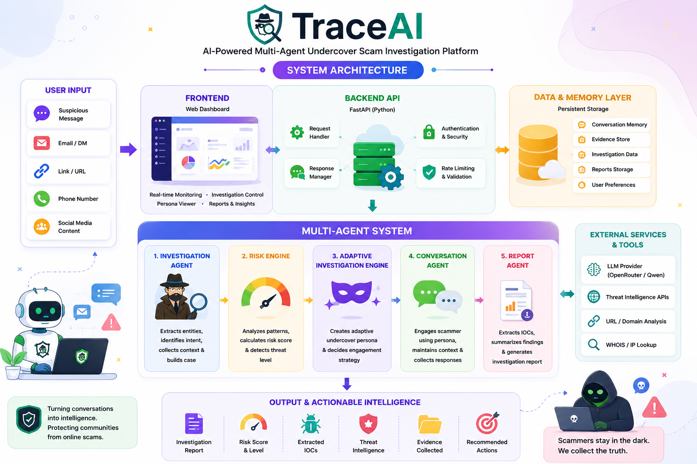

# Interactive Developer Guide for TraceAI

**This file was auto-generated by `docs/build_guide.py` — do not edit it directly.**

> Open [`interactive-guide.html`](interactive-guide.html) in your browser for the full clickable experience.

## How to open it

```bash
# from the repository root, any of these work:
open docs/interactive-guide.html        # macOS
xdg-open docs/interactive-guide.html    # Linux
# ...or simply double-click the file in your file explorer
```

The guide is a single self-contained HTML file — no build step, no internet connection, no local server needed. All CSS and JS are inlined; the only external resource is Google Fonts, which degrades gracefully offline.

## What's inside

1. **Agent pipeline tour** — the 4 agents + 6 tools with clickable cards that expand into module paths, roles, and data they exchange
2. **End-to-end flow diagram** — an animated 5-stage flowchart (Investigate → Persona → Engage → Score → Report) with step-by-step walkthrough buttons
3. **Persona engine explorer** — the threat → persona/objective/strategy mapping table with drill-downs
4. **Objective ladder simulator** — a working state-machine demo of the adaptive engine
5. **Live Risk Score simulator** — toggle scam/confidence/entities and watch the score & reasons update, exactly like `RiskEngine.calculate()`
6. **Codebase map** — every module with one-line purpose + filename, grouped by layer
7. **Session contract cheatsheet** — the exact `/analyze` request → response JSON structure with notes
8. **Glossary** — analyst terms (IOC, honeypot, decoy persona…)

## Architecture diagram (static preview)

If you cannot open HTML, here's the static architecture poster used in the main README:



## Keeping it in sync

If you change the agent pipeline, the API response contract (`backend/api.py`), the persona/objective mapping (`tools/adaptive_investigation_engine.py`) or the risk rubric (`tools/risk_engine.py`), update the corresponding constants/sections inside:

```python
docs/build_guide.py        # generator script
```

then regenerate with:

```bash
python docs/build_guide.py
```

and commit both files. (`build_guide.py` reads the live code files where useful, e.g. `_first_objective` mapping keys, to keep the guide honest.)
